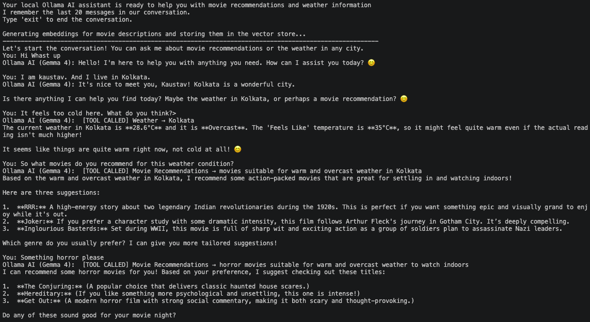

# Dotnet AI Ollama Chat Demo

> 🎯 **This is a hobby project** — A personal playground to explore and test AI possibilities locally without relying on cloud-based services.

A personal playground project demonstrating local AI chat, tool/function calling, and vector database search in .NET 10. The project integrates Microsoft.Extensions.AI, Ollama, and Microsoft Semantic Kernel's in-memory vector store.



## Features

### Core AI Capabilities
- **Local LLM Integration**: Chat client configured to run with a local Ollama instance using the Gemma 4 model (or other local models like Qwen 2.5).
- **Function Calling (Tools)**: The assistant can dynamically call local tools to fetch real-time information and perform tasks.
- **Interactive Streaming**: Interactive console loop with streaming output and conversation history management.
- **Conversation Stability**: System prompt is preserved while trimming history, which helps prevent random tool behavior over long chats.
- **Multimodal Image Analysis**: For image-analysis prompts, the app attaches real image bytes to the user message so Gemma can analyze the image directly.

### Tools & Functions
The assistant has access to a comprehensive toolkit of local functions:

- **Weather**: Retrieves current weather and air quality for any city using Open-Meteo APIs.
- **Movie Recommendations**: Performs semantic vector search over a local collection of movies based on natural language queries.
- **Mathematics**: 
  - Calculator service for basic and complex mathematical calculations (percentages, roots, trigonometry, etc.)
  - Python code execution for advanced calculations, algorithms, and complex logic.
- **Web Search**: DuckDuckGo integration to search the web and return relevant results.
- **File Operations**: Read text files and list directory contents locally.
- **Memory Management**: Remember/Forget items — the assistant can store and retrieve important information across conversations.
- **Date & Time**: Get current date, time, and day of the week.

### Image Input Behavior
- Image analysis intent is detected from prompts such as:
   - "Analyze the image"
   - "Analyze image: cat.png"
   - "Describe the image /absolute/path/photo.jpg"
- Path resolution rules:
   - If image path contains `/` or `\\`, it is treated as an explicit/full path.
   - If image path has no slash, it is resolved from the `images/` folder.
   - If no image parameter is provided, default image is `images/ai-test-image.jpg.png`.
- Build output includes the entire `images/` folder content.

### Vector Database & Embeddings
- **In-Memory Vector Store**: Seeds a collection of movies into Microsoft Semantic Kernel's `InMemoryVectorStore`, generating embeddings locally via `nomic-embed-text` and searching them using cosine similarity.
- **Semantic Search**: Natural language queries are converted to vectors and matched against stored movie descriptions for intelligent recommendations.

## Prerequisites

To run this project, you need the following installed:

1. .NET 10.0 SDK
2. Ollama running locally on port 11434

Pull the required models in Ollama:

```bash
# Pull the LLM for chat and function calling
ollama pull gemma4:latest

# Pull the embedding model for vector search
ollama pull nomic-embed-text
```

## Running the Application

1. Make sure your local Ollama service is active.
2. Navigate to the project folder and run:
   ```bash
   dotnet run --project VectorDataSearch
   ```
3. Talk to the assistant in the command line interface. Try asking questions like:
   - "How is the weather in Kolkata?"
   - "Recommend me a movie about space travel or wormholes."
   - "Analyze the image"
   - "Analyze image: sample.png"
   - "Describe image /Users/you/Pictures/cat.jpg"
   - Type "exit" to quit.

## How To Test

Use this quick checklist to validate all major features.

### 1) Setup and Build
```bash
dotnet build VectorDataSearch
```
Expected: Build succeeds.

### 2) Start the App
```bash
dotnet run --project VectorDataSearch
```

### 3) Weather Tool Test
Prompt:
```text
How is the weather in Kolkata?
```
Expected: Assistant calls weather tool and returns weather + air quality summary.

### 4) Movie Vector Search Test
Prompt:
```text
Recommend me a movie about dreams inside dreams.
```
Expected: Assistant returns semantically relevant movies with scores/descriptions.

### 5) Math Tools Test
Prompts:
```text
What is (245 * 19) / 7?
Solve x^2 - 5x + 6 = 0
```
Expected: Assistant uses calculation tools (calculator and/or Python tool) instead of mental math.

### 6) File Tools Test
Prompts:
```text
List files in current directory
Read file README.md
```
Expected: Assistant lists directory contents and reads file content.

### 7) Memory Tools Test
Prompts:
```text
Remember that my favorite genre is sci-fi
What do you remember?
Forget my favorite genre is sci-fi
```
Expected: Assistant stores, retrieves, and forgets memory items correctly.

### 8) Image Analysis (Default Image)
Place an image at `VectorDataSearch/images/ai-test-image.jpg.png` (or use existing one).

Prompt:
```text
Analyze the image
```
Expected:
- Console shows image attached message.
- Assistant analyzes image content directly.
- It should not randomly call unrelated tools like date/time for this prompt.

### 9) Image Analysis (Filename in images folder)
Place `my-cat.png` inside `VectorDataSearch/images/`.

Prompt:
```text
Analyze image: my-cat.png
```
Expected: App resolves `images/my-cat.png` and analyzes it.

### 10) Image Analysis (Explicit/Full Path)
Prompt:
```text
Describe image /absolute/path/to/photo.jpg
```
Expected: App uses the explicit path and analyzes that file.

### 11) Negative Test (Missing Image)
Prompt:
```text
Analyze image: does-not-exist.png
```
Expected: Warning logs image not found, and assistant continues without crashing.

## Project Structure

- VectorDataSearch/Program.cs: Application entry point. Configures Ollama clients, builds the IChatClient with function invocation support, seeds the in-memory vector database, and hosts the console chat loop.
- VectorDataSearch/ImagesService.cs: Image intent parsing, parameter extraction, path resolution/fallback logic, and MIME type detection for multimodal requests.
- VectorDataSearch/Movie.cs: Movie data model decorated with Semantic Kernel vector store attributes, along with a seed dataset of 40 movies.
- VectorDataSearch/WeatherService.cs: Core service responsible for calling the Open-Meteo geocoding, forecast, and air quality REST APIs.
- VectorDataSearch/WeatherModel.cs: DTOs and data models representing Open-Meteo responses.

## Key Dependencies

- Microsoft.Extensions.AI: Standardized abstractions for chat and embedding generation.
- Microsoft.SemanticKernel.Connectors.InMemory: Provides the in-memory vector database functionality.
- OllamaSharp: Client library to interface with the local Ollama instance.